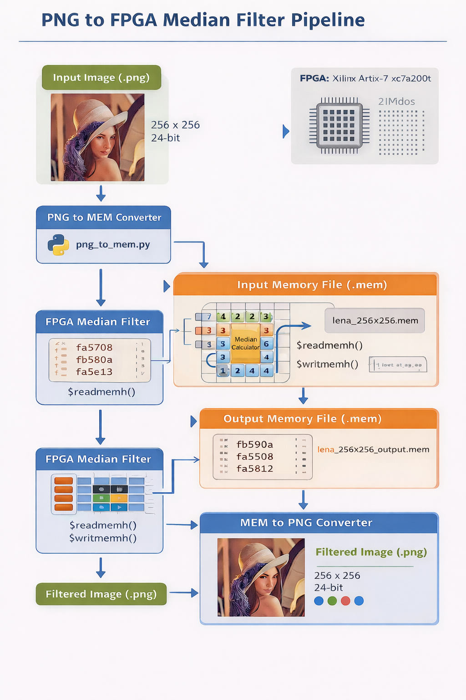

# 🚀 FPGA Median Filter for RGB Images (3×3)


---

## 📌 Overview

This project implements a **3×3 Median Filter in Verilog** to remove **salt and pepper noise** from a **24-bit RGB image (256×256)**.

It demonstrates a complete **hardware verification pipeline** combining:

- Python-based image preprocessing  
- Verilog-based hardware design  
- Vivado simulation (XSIM)  
- Image reconstruction for visualization  

The system converts an image into memory format, processes it using FPGA logic, and reconstructs the filtered output image.

To validate performance, **5% salt & pepper noise** is added and removed using the median filter.

---

## ❓ Problem Statement

Digital image data in FPGA systems:

- Cannot be directly visualized  
- Requires memory conversion (.mem format)  
- Needs verification before hardware deployment  
- Is difficult to debug without visualization  

---

## 🎯 Objective

Design and verify a **hardware-based median filter pipeline**:

PNG → MEM → FPGA (Verilog) → MEM → PNG

---

## 🧠 System Architecture

👉 **Median Filter Architecture**



### Key Components:
- Input Pixel Memory  
- 3×3 Sliding Window Generator  
- Median Calculation Unit  
- Output Memory  

---

## 🔄 Processing Pipeline

### Flow:

PNG Image → MEM Conversion → Verilog Simulation → Output MEM → PNG Reconstruction

---

## 🧩 Finite State Machine (FSM)

👉 **FSM Diagram**


### FSM States:

- **SLEEP** → Idle state  
- **ROW1** → Load first row (LINE1 <= DATA)  
- **ROW2** → Load second row (LINE2 <= DATA)  
- **ROW3** → Load third row (LINE3 <= DATA)  
- **ROUTINE** → Sliding window processing  
- **ROW256** → End-of-frame handling  

### Core Operation:

```
LINE1 <= LINE2  
LINE2 <= LINE3  
LINE3 <= DATA  
OUT = Median(line1, line2, line3)
```

---

## 📂 Image Specifications

- Resolution: **256 × 256**  
- Format: **RGB**  
- Bit Depth: **24-bit**  
- Channels: **3 (8-bit each)**  

Pixel format:

```
R (8-bit) | G (8-bit) | B (8-bit)
```

---

## ⚙️ Workflow Steps

### 1. Input Image
- `lena_256x256.png`

---

### 2. PNG → MEM Conversion

Script:

```
png_to_mem.py
```

- Reads image  
- Extracts RGB pixels  
- Converts to hexadecimal  
- Saves as `.mem` file  

---

### 3. Verilog Simulation

Files:

```
median_filter.v
tb_median_filter.v
```

Simulation:

```
$readmemh("lena_256x256.mem", image_memory);
$writememh("lena_256x256_output.mem", output_memory);
```

---

### 4. MEM → PNG Conversion

Script:

```
mem_to_png.py
```

- Reads output `.mem`  
- Reconstructs RGB image  
- Saves PNG output  

---

## 🧪 Noise Injection

Script:

```
noise_add.py
```

### Parameters:

- Noise Type: **Salt & Pepper**  
- Density: **5%**  

### Behavior:

- Salt → 255  
- Pepper → 0  

---

## 📊 Results

👉 **Output Comparison**


### Generated Outputs:

- Original Image  
- Noisy Image (5%)  
- Filtered Image  
- Noise Removed Image  

✔ Median filter successfully removes noise  
✔ Edges are preserved  

---

## 📁 Project Structure

```
Median_Filter
│
├── Input Image
│   └── lena_256x256.png
│
├── Verilog Files
│   ├── median_filter.v
│   ├── tb_median_filter.v
│   └── fsm_diagram.png
│
├── Python Scripts
│   ├── png_to_mem.py
│   ├── mem_to_png.py
│   └── noise_add.py
│
├── MATLAB
│   ├── MedianFilter.m
│   └── AdaptiveMedianFilter.m
│
├── Results
│   ├── 5 Percent Noise
│   │   ├── lena_256x256.mem
│   │   ├── lena_256x256.png
│   │   ├── lena_256x256_output.mem
│   │   └── lena_256x256_output.png
│   │
│   └── Original Image
│       ├── lena_256x256.mem
│       ├── lena_256x256.png
│       ├── lena_256x256_output.mem
│       └── lena_256x256_output.png
│
├── docs
│   ├── pipeline.png
│   └── architecture.png
│
├── Vivado Project
│   └── Median_Filter.zip
└── 
```

---

## 📦 Tech Stack

- Verilog HDL  
- Python  
- NumPy  
- OpenCV / PIL  
- Vivado (XSIM)  

---

## 🚀 Applications

- Image noise removal  
- FPGA-based vision systems  
- Medical imaging  
- Surveillance systems  
- Satellite image processing  

---

## ⚠️ Limitations

- Simulation-based (not real-time yet)  
- Fixed resolution (256×256)  
- No streaming pipeline  

---

## 🔮 Future Work

- Real-time streaming median filter  
- AXI4-Stream integration  
- Line buffer optimization  
- FPGA synthesis & benchmarking  
- Resource-efficient sorting network  

---

## 🏁 Conclusion

This project demonstrates a **complete FPGA image processing pipeline**, bridging:

✔ Software (Python)  
✔ Hardware (Verilog)  
✔ Visualization (PNG output)  

It provides a strong foundation for **real-time FPGA vision systems**.

---

## 👨‍💻 Author

FPGA + Image Processing Enthusiast  
Focus: RTL Design | Computer Vision | Hardware Acceleration
